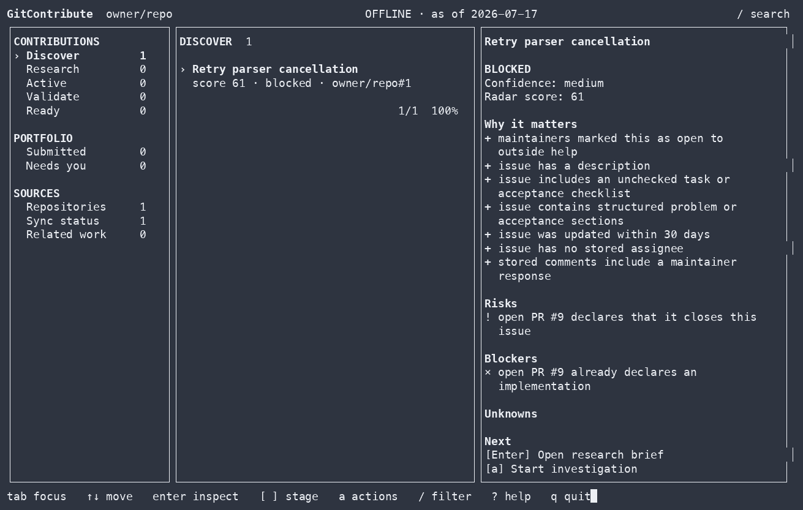

<div align="center">

# GitContribute

Local research and validation for GitHub contributions.

[](https://github.com/morluto/gitcontribute/actions/workflows/ci.yml)
[](https://www.npmjs.com/package/gitcontribute)
[](https://go.dev/)
[](LICENSE)
[](#platform-support)

[Quick start](#quick-start) · [Workflow](#contribution-workflow) · [CLI](#cli) · [MCP](#mcp) · [Safety](#side-effect-boundaries) · [Documentation](#documentation)



</div>

`gitcontribute` is available as a CLI, terminal UI, and MCP server for coding
agents.

GitHub can show you open issues. It cannot tell you whether an issue is still
relevant, already being implemented, appropriate for an outside contributor,
or supported by enough evidence to work on safely.

GitContribute collects repository guidance, related issues and pull requests,
code context, accepted contribution patterns, and validation results in a local
SQLite corpus. Results identify missing or stale coverage.

```text
find work -> understand it -> check competing work -> prove the change -> prepare the handoff
```

> [!IMPORTANT]
> GitContribute never writes to GitHub. It prepares local research and drafts
> for you to review.

## Quick start

Run the guided setup with Node.js 18 or newer:

```sh
npx --yes gitcontribute@latest setup
```

Choose **MCP** to use GitContribute from a supported coding agent, **CLI** for
the terminal and TUI, or **Both**. The wizard shows every planned change before
applying it. Adding a repository during setup does not contact GitHub or start
a sync.

After setup, start with a repository or an exact issue:

| Task | Coding agent | CLI |
| --- | --- | --- |
| Find candidates | `Find contribution candidates in owner/repo. Rank them by contribution fit, evidence, scope, and coordination risk.` | `gitcontribute archive sync owner/repo`<br>`gitcontribute radar owner/repo --limit 10` |
| Research an issue | `Investigate owner/repo#42. Check guidance, discussion, code, prior fixes, competing work, and missing evidence.` | `gitcontribute archive sync owner/repo --numbers 42`<br>`gitcontribute research brief issue:owner/repo#42` |

Results include source references, coverage gaps, and suggested next steps.

<details>
<summary><strong>Other installation options</strong></summary>

Install a persistent command:

```sh
npm install --global gitcontribute@latest
gitcontribute setup
```

Pin GitContribute to a project:

```sh
npm install --save-dev gitcontribute
npm exec -- gitcontribute setup --mode mcp --codex --token-source none --yes
```

Build from source with Go 1.26 or newer:

```sh
go install github.com/morluto/gitcontribute/cmd/gitcontribute@latest
```

Native npm binaries are included for macOS ARM64/x64, Linux ARM64/x64, and
Windows x64. You also need `git`. The `gh` CLI is optional and can provide
authentication through `gh auth token`.

</details>

## Contribution workflow

### 1. Find a candidate

Search a repository or rank its open issues by available evidence, scope,
risks, blockers, and signs that maintainer coordination is needed.

```text
Find contribution candidates in golang/go. Exclude issues with active
implementation work and explain why each remaining candidate is worth
investigating.
```

The ranking only covers stored observations. Results report incomplete
coverage.

### 2. Research an issue

Build a research brief from the issue, repository guidance, discussion, linked
work, indexed code, and historical contributions. Extracted maintainer text and
checkboxes are not presented as complete acceptance criteria.

```text
Investigate issue owner/repo#42. Summarize the confirmed problem, likely scope,
relevant code, maintainer guidance, and open questions.
```

### 3. Check related work

Look for duplicate reports, linked pull requests, closing relationships, and
semantically overlapping work before investing in an implementation.

```text
Check whether owner/repo#42 has duplicate reports or competing implementation
work. Tell me what you checked and identify any missing coverage.
```

Incomplete coverage is reported instead of being treated as proof that no
competing work exists.

### 4. Validate a change

Record a reproduction, test, benchmark, or other validation and compare the
unmodified baseline with a candidate. Validation commands run only after
explicit approval.

```text
Validate my candidate change against the baseline. Run the approved checks,
record both results, and explain whether the evidence supports the change.
```

Stored runs include the command, outcome, timing, and available process
metrics.

### 5. Prepare a draft

Create a local issue, pull-request, or review draft tied to the research and
validation evidence already collected.

```text
Prepare a pull-request draft for this contribution. Tie its claims to the
recorded evidence, include the validation results, and do not post anything.
```

Draft revisions retain their exact rendered bytes and provenance.

## Interfaces and storage

GitContribute stores repositories, threads, code snapshots, investigations,
evidence, validation results, and contribution outcomes in SQLite. Network
access is explicit; once information has been synced, corpus search and
inspection work offline.

```text
 GitHub read APIs                  Local checkout
       |                                |
       | explicit sync / hydrate        | explicit index / acquire
       v                                v
  +------------------------------------------------+
  |              Local SQLite corpus               |
  | observations · coverage · evidence · outcomes  |
  +------------------------+-----------------------+
                           | offline reads
                 +---------+---------+
                 v                   v
              CLI / TUI          Coding agents
```

The CLI and MCP server use the same application services and side-effect
boundaries.

## CLI

The CLI exposes the same workflow without requiring an MCP client:

```sh
# Sync repository context and current threads
gitcontribute archive sync-context owner/repo
gitcontribute archive sync owner/repo

# Find and inspect contribution candidates
gitcontribute radar owner/repo --limit 10
gitcontribute research brief issue:owner/repo#42

# Search stored threads and indexed code
gitcontribute search threads "connection timeout" --repo owner/repo
gitcontribute search code "context.WithTimeout" --repo owner/repo
```

For implementation work:

```sh
gitcontribute investigation start-thread issue:owner/repo#42 --json
gitcontribute workspace create <investigation-id>
gitcontribute validation define --kind=test --command="go test ./..." \
  --working-dir=/path/to/workspace <investigation-id>
gitcontribute validation run <validation-id> --kind=base --execute
gitcontribute validation run <validation-id> --kind=candidate --execute
gitcontribute validation compare <base-run-id> <candidate-run-id>
gitcontribute readiness opportunity <opportunity-id>
gitcontribute prepare pr --approach="Bound retries with context" \
  --workspace <workspace-id> <opportunity-id>
```

Run `gitcontribute --help` or `gitcontribute <command> --help` for the complete
command and flag reference. Most non-interactive commands accept `--json`;
machine-readable output goes to stdout and progress goes to stderr.

Launch the local TUI with:

```sh
gitcontribute tui
```

## MCP

The MCP server advertises one unified catalog. Hosts such as Codex and Claude
Code can discover large MCP catalogs with native tool search, so setup does not
ask users to choose permanent capability profiles.

```sh
gitcontribute setup --mode mcp --codex --token-source none --yes
gitcontribute setup --mode mcp --all-clients --token-source none --yes
```

To start the stdio server directly:

```sh
gitcontribute mcp serve --transport=stdio
```

Add `--read-only` to remove tools that permit local writes or execution. See
[Scalable MCP workflows](docs/mcp-scalable-workflows.md) for the tool sequence,
coverage model, partial-result recovery, and side-effect boundaries.

## Side-effect boundaries

GitContribute separates corpus reads, GitHub reads, local writes, process
execution, and external mutation.

| Operation | Network | Local write | Runs a process | GitHub write |
| --- | :---: | :---: | :---: | :---: |
| Search and inspect stored research | No | No | No | No |
| Record investigations and evidence | No | Yes | No | No |
| Sync or hydrate GitHub context | Yes | Yes | No | No |
| Acquire and index code | Yes | Yes | `git` only | No |
| Run an explicitly approved validation | No by default | Yes | Yes | No |

- Corpus reads never fetch data.
- Crawling and indexing never execute repository-controlled code.
- Explicit validation commands run on your host with your user permissions.
- GitContribute has no GitHub mutation capability.
- There is no hosted corpus or product telemetry.

See [Architecture](docs/architecture.md) for the complete boundary definitions.

## Documentation

- [Onboarding and configuration](docs/onboarding.md)
- [Scalable MCP workflows](docs/mcp-scalable-workflows.md)
- [Architecture and side-effect boundaries](docs/architecture.md)
- [Operational runbooks](docs/runbooks.md)
- [Security policy](SECURITY.md)
- [Contributing](CONTRIBUTING.md)

## Storage

GitContribute follows platform conventions:

| Platform | Configuration | Data |
| --- | --- | --- |
| Linux | `$XDG_CONFIG_HOME/gitcontribute` or `~/.config/gitcontribute` | `$XDG_DATA_HOME/gitcontribute` or `~/.local/share/gitcontribute` |
| macOS | `~/Library/Application Support/gitcontribute` | `~/Library/Application Support/gitcontribute/Data` |
| Windows | `%APPDATA%\gitcontribute` | `%LOCALAPPDATA%\gitcontribute\Data` |

The default corpus is `gitcontribute.db` in the data directory. Run
`gitcontribute metadata` or `gitcontribute doctor --json` to inspect the local
setup.

## Platform support

Linux and macOS are the primary development and test targets. Windows builds
are tested in CI and use the standard `%APPDATA%` and `%LOCALAPPDATA%`
locations.

## Development

```sh
make verify
go run ./cmd/gitcontribute --help
```

Before changing package boundaries or side effects, read
[docs/architecture.md](docs/architecture.md). See
[CONTRIBUTING.md](CONTRIBUTING.md) for the repository workflow.
